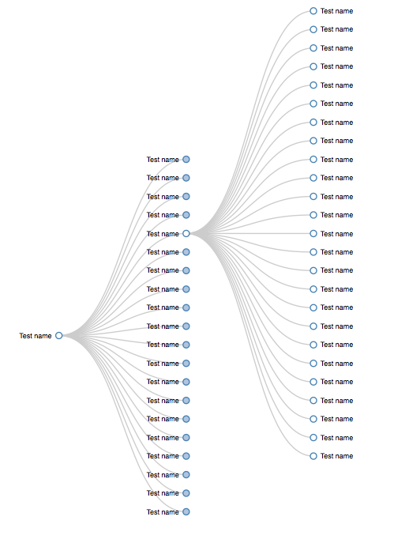
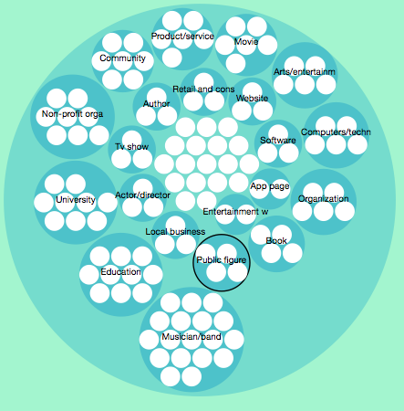
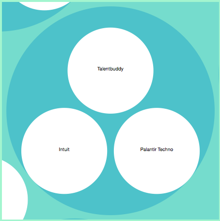

facebook-visualization
======================

Visualization of Facebook Data of you and your network

###Facebook Login

###Collapsible Tree
Our data is organized in a very tree like format. Every user has a list of friends, every friend likes several pages. It seems that Collapsible Tree (http://bl.ocks.org/mbostock/4339083) would be a good idea for a potential visualizaiton. Some concerns. What happens if we have a lot of friends? The vizualization becomes hard to read. What happens if we have a lot of friends' likes open at the same time? The vizualization became very messy very quickly. That is why we decided to instead show only one's friend likes at a time and collapse the rest of the friends. This can be seen in the image below. The test data were organized in a format of User -> Friend -> Like.

The visualization did not look particularly appealing aesthetically and at the same time it did not summarize very well the likes of our friends.

###Bubbles, bubbles everywhere

