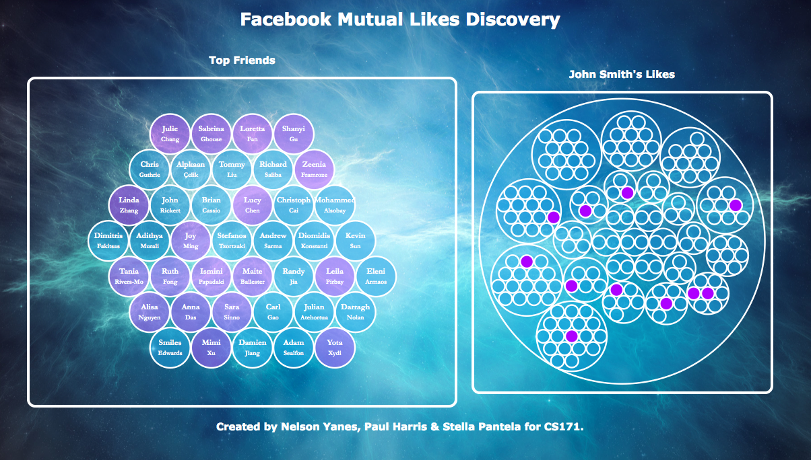

facebook-visualization
======================
Visualizing Facebook Likes of your network.

Stella Pantela, Nelson Yanes, Paul Harris.

## Live Demo
http://spant.github.io/facebook-visualization/

## Video
https://www.youtube.com/watch?v=8Y2l6omL7ZA&feature=youtu.be

## Process Book
http://goo.gl/BCjpCi

## Instructions 
1. Go to your repository and type in the command line `python -m SimpleHTTPServer`
2. Visit `http://localhost:8880`
3. Click the facebook log-in button and start interacting with the visualization

## d3 visualization library examples we used

1. Zoomable Circle Packing (http://bl.ocks.org/mbostock/7607535)
2. Bubble Chart (http://bl.ocks.org/mbostock/4063269)
3. Collapsible Tree (http://bl.ocks.org/mbostock/4339083)

## Telling a story

After thinking about our data and the principles of the class we realized it would be awesome to be able to tell a story of some sort. Friends want to stalk their friends and what better way to do it than with a visualization that expores their likes. We rank your friends and only show the top people (i.e. the friends that you have the most mutual friends with) and then we allow you to look at their likes. Likes are arranged by category. Also, common likes between you and the friend you are checking out have a differnt color, pretty cool, huh? Let the stalking begin.

Also, sometimes users want to quickly check out the common likes without zooming in. That is why we implemented a tooltip functionality for the common likes. Finally we made it look pretty by choosing an awesome background and cool colors! Let the stalking begin.

