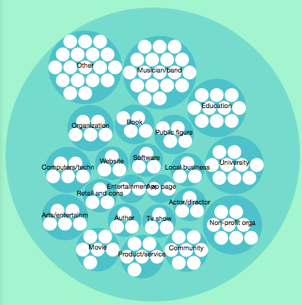
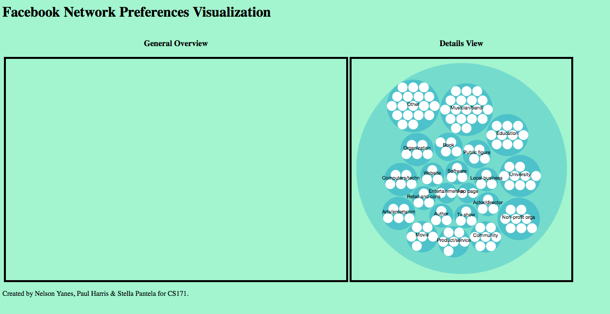
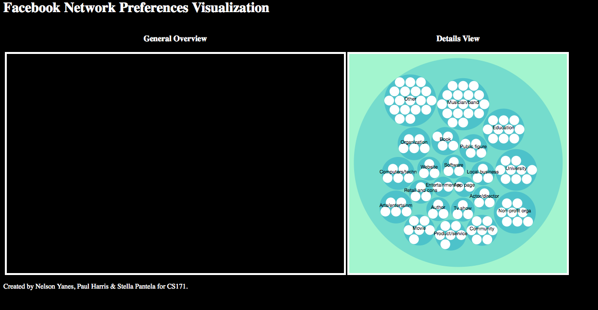

facebook-visualization
======================

Visualization of Facebook Data of you and your network

###Facebook Login

###Collapsible Tree
Our data is organized in a very tree like format. Every user has a list of friends, every friend likes several pages. It seems that Collapsible Tree (http://bl.ocks.org/mbostock/4339083) would be a good idea for a potential visualizaiton. Some concerns. What happens if we have a lot of friends? The vizualization becomes hard to read. What happens if we have a lot of friends' likes open at the same time? The vizualization became very messy very quickly. That is why we decided to instead show only one's friend likes at a time and collapse the rest of the friends. This can be seen in the image below. The test data were organized in a format of User -> Friend -> Like.

The visualization did not look particularly appealing aesthetically and at the same time it did not summarize very well the likes of our friends.

###Bubbles, bubbles everywhere

  

Originally we were getting many white circles isolated from the rest of the graph and not belonging to a greater category circle. These circles belonged to categories with only one element. To make the visualization more consise we grouped them together into a category called Other and filtered out the Categories with just one element. The result can be seen in the next figure.

###Putting it together and making a story

After thinking about our data and the principles of the class we realized it would be awesome to actually be able ot tell a story of some sort. That is why we chose to switch to a general and a details view. We have marked both in our new design and integrated the bubbles view in the details view. The general view will be coming soon and will show all our friends. The more likes a friend has the bigger their bubble. Then once we click on a friend we see the details view. You can see our current views in the Figure below.

And the black version which looks better:

