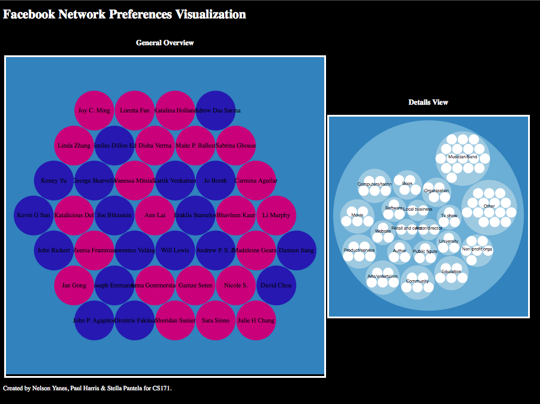

facebook-visualization
======================

### Goal
Visualization of Facebook Likes of your network.

###Step 1: Facebook Login
The first step to get started with our visualization was user login. For that we use the js facebook sdk and followed the pretty well documented procedure from the website.

###Step 2: Initial Data exploration using Collapsible Tree
Originally we organized the facebook data in a tree like format using Collapsible Tree (http://bl.ocks.org/mbostock/4339083) would. Every user has a list of friends, every friend likes several pages.  Some concerns about this visualization came up when users had a lot of friends and every friend had more than 10 likes. The visualization became hard to read and very messy very quickly To fix that we only displayed the likes of only one friend at a time and the visualization was definitely decluttered. This can be seen in the image below. 

For privacy reasons we have removed the actual names of the data but you can assume that the different levels of the tree correspond to User -> Friend -> Like.

The visualization did not look particularly appealing aesthetically and at the same time it did not summarize very well the likes of our friends. That is when we decided to pivot.

###Bubbles, bubbles everywhere

We tried out the Zoomable Circle Packing(http://bl.ocks.org/mbostock/7607535) to represent a user's likes. The result can be seen in the following two images. The first one shows the general view and the second one shows the zoomed in view.

  

Originally we were getting many white circles isolated from the rest of the graph and not belonging to a greater category circle. These circles belonged to categories with only one element. To make the visualization more consise we grouped them together into a category called Other and filtered out the Categories with just one element. The result can be seen in the next figure.

###Creating a general view

After deciding on the details view it was time to work on a general view of our friends. Male friends are blue bubbles and female friends are red and once we click on a friend we see the details view. 

For the general bubbles design we built on Bubble Chart (http://bl.ocks.org/mbostock/4063269) . You can see our current views in the Figure below.

### Telling a story
After thinking about our data and the principles of the class we realized it would be awesome to actually be able to tell a story of some sort. Friends want to stalk their friends and what better way to do it than with a visualization that expores their likes. We rank your friends and only show the top people (i.e. the friends that you have the most mutual friends with) and then we allow you to look at their likes. Likes are arranged by category. Also, common likes between you and the friend you are checking out have a differnt color, pretty cool, huh? Let the stalking begin.

